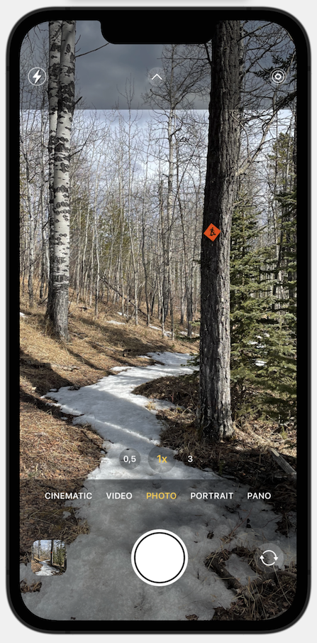

I did a quick pass on the UI trying to get as much of the details as acccurate as possible. The whole process took 17:12 but I could have probably spent double the time getting things even more accurate.

The [Screen Recording](https://github.com/aerickson14/SwiftUICameraAppSpeedRun/blob/main/CameraApp%20Speedrun-720-export.mov) has also been uploaded to this repository, but I had to export it as 720p in order to reduce the file size. If I find a better way to convert the 1.57gb original screen recording file, I'll replace this one.